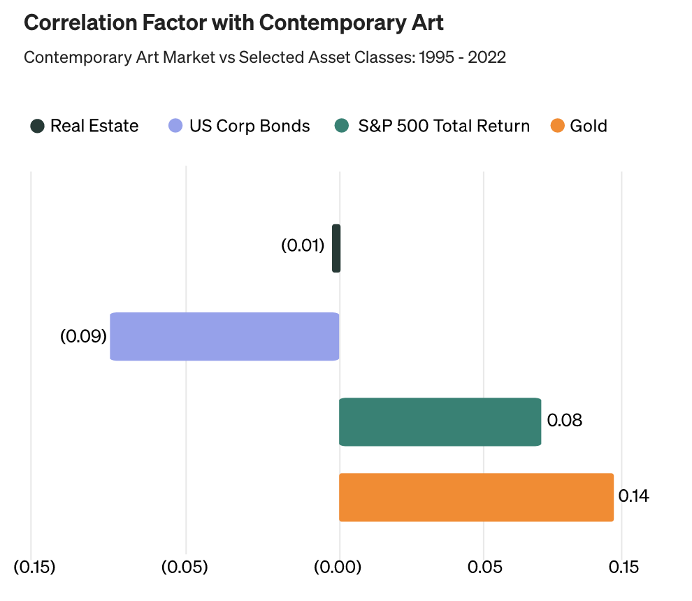
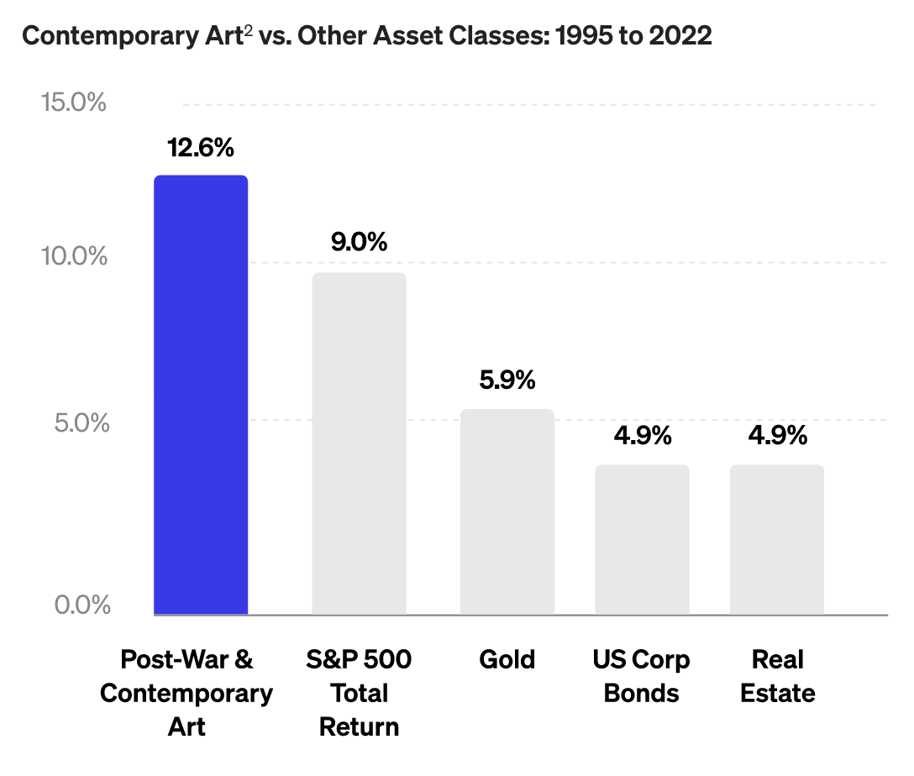
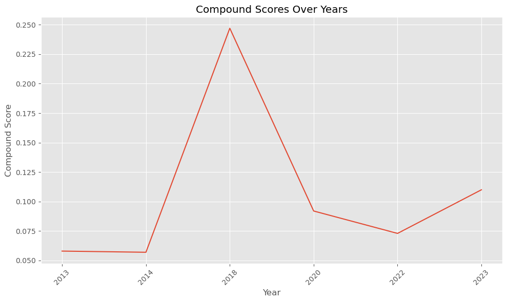
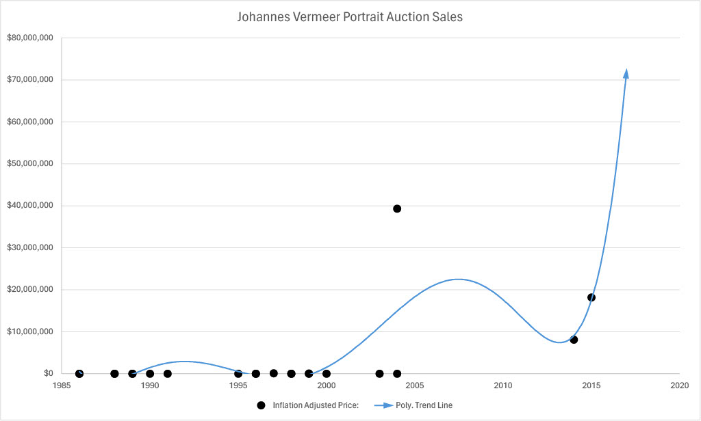

# Background

Diversification and appreciation are key considerations in investment,
spanning various assets like stocks and real estate. Art, often
overlooked due to high costs, presents significant potential. Over time,
art has shown remarkable appreciation, sometimes outpacing the S&P 500.
Notably, during events like the COVID-19 pandemic, while traditional
markets faltered, the art market exhibited resilience and even
appreciation. Art offers not only financial gains but also serves as a
hedge against market volatility and economic uncertainties.

{#fig:enter-label width="0.5\\linewidth"}

# Summary

Our goal is to create a platform that lets individuals become partial
owners of artwork, democratizing art investment. We achieve this by
offering fractional shares in prestigious artworks, removing traditional
barriers and making art investment accessible to a wider audience. This
fosters inclusivity and expands opportunities for cultural appreciation
and financial growth.

{#fig:enter-label width="0.5\\linewidth"}

The platform will feature a curated selection of artworks for users to
invest in, along with comprehensive historical auction pricing data and
our own machine learning-driven valuations and market trend predictions.
Using gradient boosting to estimate current valuation and NLP to gauge
art sentiment and predict future market trends, the platform equips
users with ample information to make informed investment decisions
confidently.

# Data Collection

Private sale auctions have become the dominant practice in the art
world, with major players like Christie's, Sotheby's, Phillips, Bonhams,
and Heritage Auctions often keeping price information confidential. As a
result, obtaining historical pricing data on artworks is challenging,
with many datasets behind paywalls, limiting access for researchers.

Adding to the difficulty is the lack of comprehensive documentation for
artworks, with many pieces poorly cataloged or entirely undocumented.
This scarcity of information restricts the range of features available
for analysis. Moreover, the qualitative nature of art complicates
efforts to quantify its attributes for modeling purposes.

Despite these challenges, we explore potential solutions and address
them in our \"Future Improvements\" section. Although our efforts faced
obstacles, we made use of a Kaggle Database, albeit with limited
features.

For NLP sentiment analysis of the market, we collected our own data by
selectively choosing articles related to the artwork, artist, style,
medium, or specific work. We used Beautiful Soup to scrape the website
and extract the content as a string.

# Pricing Model Development

To train this model, we used **Catboost**, an open-source library that
provides a gradient boosting framework. Importantly, it has built-in
support for categorical features, which was used throughout this
dataset. Recent research has shown Catboost to be one of the most
powerful libraries for training tabular data.

## Feature Engineering

To extract more features from the original dataset, we **feature
engineered** several binary variables. For instance, the `condition`
feature of the original dataset included complete sentences on quality
of the art: \"This work is in **excellent** condition, direct from the
publisher\" (emphasis mine). To extract features, a binary variable was
introduced whether the descriptions had certain words:

``` {.python frame="single" framesep="2mm" fontsize="\\footnotesize" linenos="" breaklines=""}
conditions = ['excellent', 'direct from publisher', 'frame abrasion', 'original condition', 'very good', 'not examined', 'tears', 'occasional marks', 'oxidation', 'scratches']
for condition in conditions:
    df_filtered[f'{condition.replace(" ", "_")}'] = df_filtered['condition'].str.contains(condition, case=False).astype(int)
```

In all, the following features were engineered from the original
dataset:

::: {#table:binary_features_art}
  **Feature Name**        **Description**
  ----------------------- --------------------------------------
  is_signed               Artwork signed by the creator
  excellent_condition     Minimal to no damage
  direct_from_publisher   Acquired directly from the publisher
  frame_abrasion          Frame damage present
  original_condition      Maintains initial state
  very_good_condition     Minor signs of wear
  not_examined            Condition not inspected
  tears                   Physical damage present
  occasional_marks        Sporadic imperfections
  oxidation               Chemical aging signs
  scratches               Surface damage

  : Binary Features Derived from Art Descriptions
:::

## Hyperparameter Tuning

To tune hyperparameters, **random search** was used on the following
attributes:

-   **depth**: Specifies the maximum depth of the trees.

-   **learning_rate**: Determines the step size at each iteration while
    moving toward a minimum of the loss function.

-   **iterations**: The number of trees to be built in the ensemble.

Random search was used over grid search because it can more efficiently
navigate the hyperparameter space when dealing with a large number of
variables and their possible combinations. By randomly sampling the
space, it often finds a good enough solution with significantly less
computational effort and time. The random search yielded the following
hyperparameters: `iterations=1500, learning_rate=0.1,depth=6`.

## Model Results

The model's resulting RMSE was $\$10,347.13$, indicating on average, the
model's predictions deviate from the observed values by around ten
thousand dollars. The $R^2$ value for the model was $0.07$, indicating
little predictive power, likely due a very small dataset and the fact
that the artist's name plays a major role in the value of the art.

::: {#tab:feature_importance}
  **Feature**          **Importance (%)**
  -------------------- --------------------
  excellent            50.858972
  period               14.177459
  movement             13.769233
  not_examined         9.259292
  yearCreation         9.119574
  is_signed            1.843217
  left                 0.581838
  very_good            0.296340
  original_condition   0.052118
  occasional_marks     0.041958

  : Feature Importance in Predictive Model
:::

\
Features not shown have zero importance to the nearest thousandths
place.

# Sentiment Model Development

Due to the wide range of sentiment analysis and NLP Python open-source
packages available, we initially opted for the TextBlob package due to
its simplicity and our time constraints. However, we encountered two
significant issues with this approach. Firstly, the program output
provided discrete values of $[1, 0, -1]$, leading to oversimplifications
and lacking nuance for future predictions or current sentiment
approximation. Secondly, TextBlob categorizes data into polarity and
subjectivity, which we found inadequate for understanding market trends
and sentiment accurately.

In response to these concerns, we transitioned to using **NLTK**
(Natural Language Toolkit). The following section will outline our
approach in detail.

## NLTK Lexicon and Rule-based Model

In our implementation, we chose to utilize NLTK's pretrained sentiment
analysis due to its flexibility and ease of use. We integrated NLTK's
optimizations including stemming and stop word removals to preprocess
the text data. Stemming condenses words into their base forms,
simplifying the vocabulary by collapsing different conjugations. Stop
words removal filters out common words, enhancing the focus on
meaningful content by reducing noise. While NLTK also offers
lemmatization, we decided not to utilize it as maintaining readability
in the output language was not crucial for our specific use case.
Overall, these optimizations contribute to improving the efficiency and
effectiveness of our sentiment analysis task.

## NLTK Results

By leveraging NLTK's pretrained sentiment analysis and incorporating
stemming and stop word removals for text preprocessing, we successfully
estimated the market sentiment regarding a painting. We then plotted
these sentiment scores, derived from various articles over time, to
visualize the fluctuation in market perception. With this chart in hand,
we can establish trend lines that provide insights into market trends,
enabling us to make informed predictions about the hypothetical future
valuation of an art piece. This approach empowers us to better
understand market sentiment dynamics and make strategic decisions
regarding art investment and valuation.

{width="1\\linewidth"}

# Historical Price Visualization

As a proof of concept, we manually entered historical sales data of the
artist, adjusting amounts for inflation to ensure consistency.
Additionally, we applied polynomial regression forecasting to illustrate
the data trend. We opted for this approach due to the wide deviations in
data points, which is typical in investment valuations.

{width="1\\linewidth"}

To enhance visual representation, we aimed for an aesthetic reminiscent
of the Dow Jones index, aiming to emphasize the idea that art
investments should be approached with a similar mindset. This visual
style helps convey the message effectively.

# Future Improvements

## Pricing Model

The pricing issue stems from limited data and feature sets. To address
this, a solution could involve an upfront fee for access to historical
data and professional evaluation of artworks. Alternatively, computer
vision and a classification model could be employed to analyze paintings
for style and medium information.

## Sentiment Model

Challenges arose with the NLTK pretrained model, which focuses on
emotionally charged words but may miss crucial terms impacting market
predictions. A more robust approach is needed to capture nuanced market
trends, including consistent methods for article selection.

## Share Quantity and Pricing Strategies

While our business strategy is evolving, initial share quantities could
be determined by the seller, demand prediction models, or industry
standards. Share prices would be calculated by dividing the current
valuation by the number of shares. Artworks would be held, possibly
displayed, for a set period before profit distribution among
shareholders upon sale, akin to a bond.

# References
